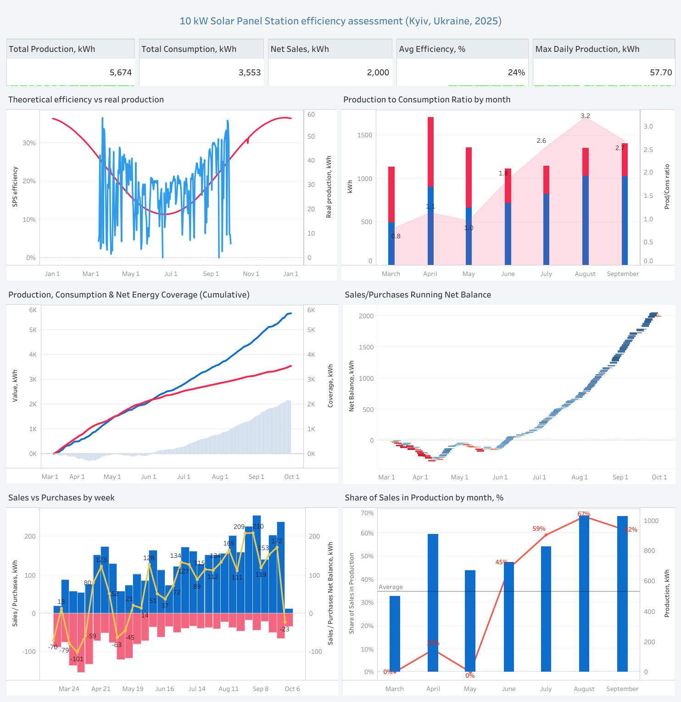

# 🌞 Solar PV Performance Dashboard — Kyiv 10 kW Vertical System  

**Status:** Operational since **March 2025**  
**Location:** Kyiv, Ukraine  
**Type:** Residential / Prosumer PV System  
**Capacity:** 10 kW (vertical panels)  
**Grid:** Connected (bi-directional — sell & buy)  

---

## 🔍 Overview  

This project presents a real-world performance analysis of a **10 kW vertical solar power station** located in **Kyiv, Ukraine**.  
The goal is to evaluate **production efficiency**, **consumption balance**, and **energy exchange with the national grid** based on daily operational data.

The dashboard was built in **Tableau**, with supplementary calculations and visualizations performed in **Python** (PVLib, Pandas, Matplotlib).

---

## 📸 Dashboard Preview  

> Tableau dashboard illustrating production, consumption, and grid balance metrics for the Kyiv 10 kW vertical solar system.

---

## 🌐 Live Dashboard

🔗 [View Interactive Dashboard on Tableau Public](https://public.tableau.com/views/10kWSolarPanelStationefficiencyassessmentKyivUkraine2025/SPSDashboard?:language=en-US&:sid=&:redirect=auth&:display_count=n&:origin=viz_share_link)

Explore real-time generation, consumption, and grid balance data for the Kyiv 10 kW vertical solar power system.

---

## 🎯 Objectives  

- Assess daily and monthly **generation efficiency** of vertically mounted PV panels.  
- Visualize **energy balance** — self-consumption, grid purchase, and grid export.  
- Track **seasonal variation** in solar production and household consumption.  
- Provide a **data-driven view** of system profitability and sustainability.

---

## 🧠 Tools & Technologies  

| Category | Tools / Libraries |
|-----------|------------------|
| Data Processing | Python, Pandas, PVLib |
| Visualization | Tableau Public |
| Data Sources | Smart Meter exports (Solarman Smart), Excel logs |
| Supporting Tools | Excel, Google Sheets |

---

## 📊 Dashboard Structure  

**1. Production vs Consumption Overview**  
Displays daily solar generation and electricity usage, highlighting **self-consumed** and **exported** energy.  

**2. Grid Interaction (Waterfall / Stacked Bar)**  
Shows the **energy sold to** and **purchased from** the grid over time, providing an instant balance view.  

**3. Monthly Performance Summary**  
Aggregated view of total production, self-consumption ratio, and grid dependence.  

**4. Efficiency Trend (Python → Tableau)**  
A Python-generated efficiency index visualized in Tableau, reflecting actual vs. theoretical output.

---

## 📂 Repository Structure  

data/           → Raw & cleaned Excel datasets (production, consumption)  
tableau/        → Packaged Tableau workbook (.twbx)  
python/         → Scripts for efficiency and PV performance analysis  
results/        → Screenshots and exports of Tableau dashboards  
README.md       → Project overview and insights  

---

## 🔍 Methodology  

1. **Data Collection** — Smart meter & inverter data (daily kWh values).  
2. **Data Cleaning** — Removal of missing/duplicate entries, normalization by date.  
3. **Performance Metrics:**  
   - Production / Consumption ratio = Production / Consumption 
   - Grid Export = Production – Consumption (if positive), monthly  
   - Grid Import = Consumption – Production (if positive), monthly  
   - Efficiency = Actual Production / Expected (PVLib model)  
4. **Visualization** — Tableau dashboards for intuitive exploration.  

---

## 📈 Insights  

- The total **solar generation exceeded household consumption by 1.6×** during the analyzed period,  
  reaching a **peak of 3.2× in August**.  

- The **net energy sold** to the grid (after subtracting purchased energy) reached **2,000 kWh over 7 months**.  

- The system achieved **full coverage (production ≥ consumption)** after **2.5 months** of operation.  

- The **average share of exported energy** in total production was **35%**,  
  with a **maximum of 67% in August**.  

- The **average operational efficiency** of the 10 kW vertical solar plant was **24%** over the first 7 months,  
  outperforming typical **commercial monocrystalline panels (≈ 19–22%)**.

- I expect that vertical installation will provide **better winter performance** than in the summer months.
  More on that later.
  
---

## 🚀 Next Steps  

- **Extend dataset** to cover a full annual cycle (March 2025 – March 2026) for seasonal pattern analysis.  
- **Automate data collection** via the Solarman Smart API to ensure real-time dashboard updates.  
- **Add cost and revenue analysis** to estimate payback period and ROI of the system.  
- **Compare vertical vs. optimal-tilt performance** using PVLib modeling for Kyiv latitude.  

---

## 📎 Credits  

**Author:** Julia Pohrebitska  
**Role:** Data Analyst / PV System Owner / Dashboard Developer  

**Tools:** Tableau · Python · PVLib · Excel  
**Location:** Kyiv Region, Ukraine  

